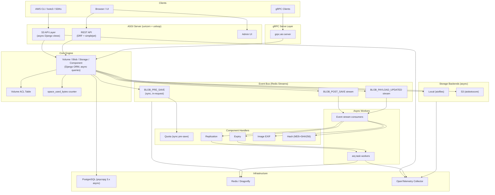
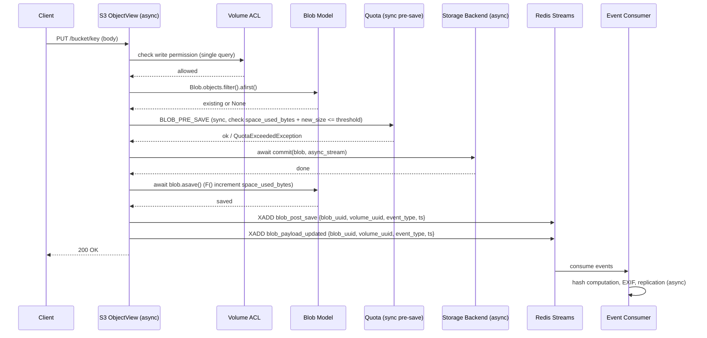

# Technical Design Document: p2 Modernization

## Overview

This design modernizes the p2 S3-compatible object storage system from its current Django 2.2 / Python 3.7 / synchronous architecture to a fully async Django 5.x / Python 3.12+ stack. The modernization touches every layer: the ASGI server, the S3 API views, the task queue, the event bus, the permission model, the storage backends, the gRPC serve layer, authentication, observability, and deployment.

The guiding principle is **async-first, sync-where-required**. The only synchronous path retained is the `BLOB_PRE_SAVE` quota check, which must block the request to prevent over-quota writes. Everything else — post-save handlers, payload processing, replication, hash computation, EXIF extraction — moves to async event consumers or async task workers.

### Key Design Decisions

| Decision | Rationale |
|---|---|
| Redis Streams over NATS | Already using Redis; avoids adding a new dependency. Dragonfly supports Streams. |
| arq over Celery | Native async, Redis-backed, minimal overhead. Matches the async runtime. |
| Volume-level ACLs over django-guardian | Eliminates per-blob permission rows. Single indexed query per request. |
| Counter column for space_used | O(1) quota checks instead of aggregate scans over all blobs. |
| MD5 + SHA256 only | MD5 for S3 ETags, SHA256 for AWS v4 auth. SHA1/384/512 are unused. |
| OpenTelemetry over structlog+Sentry+Prometheus | Vendor-neutral, single SDK for traces/metrics/logs. |
| authlib over mozilla-django-oidc | Actively maintained, supports PKCE and OIDC Discovery natively. |

## Architecture



### Request Flow: Object PUT (async)



## Components and Interfaces

### 1. Async Storage Backend Interface

Replaces the current synchronous `StorageController` base class.

```python
# p2/core/storages/base.py
from typing import AsyncIterator

class AsyncStorageController:
    """Base async storage controller."""

    async def get_read_stream(self, blob) -> AsyncIterator[bytes]:
        """Yield chunks of blob data asynchronously."""
        raise NotImplementedError

    async def commit(self, blob, stream: AsyncIterator[bytes]) -> None:
        """Write blob data from async stream."""
        raise NotImplementedError

    async def delete(self, blob) -> None:
        """Delete blob data."""
        raise NotImplementedError

    async def collect_attributes(self, blob) -> dict:
        """Collect size, MIME type, etc. Return attribute dict."""
        raise NotImplementedError
```

- **Local backend**: Uses `aiofiles` for filesystem I/O. MIME detection via file extension mapping (`mimetypes` stdlib) instead of `python-magic` (which requires sync libmagic calls).
- **S3 backend**: Uses `aiobotocore` session/client. Streams via `get_object()['Body'].read(chunk_size)` async iteration.
- **Retry**: Transient errors (IOError, ClientError with retryable status) retry with exponential backoff, max 3 attempts.

### 2. Volume ACL Model

Replaces django-guardian per-object permissions.

```python
# p2/core/acl.py
class VolumeACL(models.Model):
    volume = models.ForeignKey(Volume, on_delete=models.CASCADE, related_name='acls')
    user = models.ForeignKey(User, on_delete=models.CASCADE, null=True, blank=True)
    group = models.ForeignKey(Group, on_delete=models.CASCADE, null=True, blank=True)
    permissions = models.JSONField(default=list)  # ["read", "write", "delete", "list", "admin"]

    class Meta:
        unique_together = [('volume', 'user'), ('volume', 'group')]
        indexes = [
            models.Index(fields=['volume', 'user']),
            models.Index(fields=['volume', 'group']),
        ]
```

Permission check (single query):
```python
async def has_volume_permission(user, volume, permission: str) -> bool:
    if volume.public_read and permission == "read":
        return True
    return await VolumeACL.objects.filter(
        Q(user=user) | Q(group__in=await user.agroups.all()),
        volume=volume,
        permissions__contains=[permission]
    ).aexists()
```

### 3. Event Bus (Redis Streams)

```python
# p2/core/events.py
import redis.asyncio as aioredis

STREAM_BLOB_POST_SAVE = "p2:events:blob_post_save"
STREAM_BLOB_PAYLOAD_UPDATED = "p2:events:blob_payload_updated"

async def publish_event(stream: str, event: dict):
    """Publish event to Redis Stream."""
    r = aioredis.from_url(settings.REDIS_URL)
    await r.xadd(stream, event, maxlen=100_000)

async def consume_events(stream: str, group: str, consumer: str, handler):
    """Consume events from Redis Stream with consumer group."""
    r = aioredis.from_url(settings.REDIS_URL)
    try:
        await r.xgroup_create(stream, group, id='0', mkstream=True)
    except aioredis.ResponseError:
        pass  # group already exists
    while True:
        messages = await r.xreadgroup(group, consumer, {stream: '>'}, count=10, block=5000)
        for _, entries in messages:
            for msg_id, data in entries:
                await handler(data)
                await r.xack(stream, group, msg_id)
```

Event payload schema:
```json
{
    "blob_uuid": "hex-string",
    "volume_uuid": "hex-string",
    "event_type": "blob_post_save | blob_payload_updated",
    "timestamp": "ISO-8601"
}
```

`BLOB_PRE_SAVE` remains a synchronous in-process call (not on the event bus) because the quota controller must be able to block the save.

### 4. arq Task Queue

Replaces Celery for all background tasks.

```python
# p2/core/worker.py
from arq import create_pool, cron
from arq.connections import RedisSettings

async def run_expire(ctx):
    """Periodic expiry sweep."""
    ...

async def replicate_metadata(ctx, blob_pk: str):
    """Replicate blob metadata to target volume."""
    ...

async def replicate_payload(ctx, blob_pk: str):
    """Replicate blob payload to target volume."""
    ...

async def complete_multipart(ctx, upload_id: str, user_pk: int, volume_pk: str, path: str):
    """Assemble multipart upload parts."""
    ...

class WorkerSettings:
    functions = [replicate_metadata, replicate_payload, complete_multipart]
    cron_jobs = [cron(run_expire, second=0)]  # every minute
    redis_settings = RedisSettings.from_dsn(settings.REDIS_URL)
    max_jobs = 50
    job_timeout = 300
    retry_jobs = True
    max_tries = 5
```

### 5. Async S3 Views

All S3 views become async Django views.

```python
# p2/s3/views/objects.py (modernized)
class ObjectView(S3View):
    async def get(self, request, bucket, path):
        volume = await self.get_volume(request.user, bucket, "read")
        blob = await Blob.objects.filter(path=path, volume=volume).afirst()
        if not blob:
            raise AWSNoSuchKey
        stream = volume.storage.controller.get_read_stream(blob)
        response = StreamingHttpResponse(stream, content_type=blob.attributes.get(ATTR_BLOB_MIME))
        response['Content-Length'] = blob.attributes.get(ATTR_BLOB_SIZE_BYTES, 0)
        return response

    async def put(self, request, bucket, path):
        volume = await self.get_volume(request.user, bucket, "write")
        blob, created = await self.get_or_create_blob(volume, path, request.user)
        # Sync pre-save check (quota)
        await sync_to_async(self.fire_pre_save)(blob)
        await volume.storage.controller.commit(blob, request_body_chunks(request))
        await blob.asave()
        await publish_event(STREAM_BLOB_POST_SAVE, {...})
        await publish_event(STREAM_BLOB_PAYLOAD_UPDATED, {...})
        return HttpResponse(status=200)
```

### 6. gRPC Serve Layer (async)

```python
# p2/serve/grpc.py (modernized)
class Serve(ServeServicer):
    async def RetrieveFile(self, request, context):
        user = await self.get_user(request)
        blob = await self.get_blob_from_rule(request, user)
        if not blob:
            return ServeReply(matching=False, data=b'', headers={})
        # Stream blob data
        chunks = []
        async for chunk in blob.volume.storage.controller.get_read_stream(blob):
            chunks.append(chunk)
        return ServeReply(matching=True, data=b''.join(chunks), headers=blob.tags.get(TAG_BLOB_HEADERS, {}))
```

Uses `grpc.aio.server()` instead of synchronous `grpc.server()`.

### 7. OpenTelemetry Instrumentation

```python
# p2/core/telemetry.py
from opentelemetry import trace, metrics
from opentelemetry.sdk.trace import TracerProvider
from opentelemetry.sdk.metrics import MeterProvider
from opentelemetry.exporter.otlp.proto.grpc.trace_exporter import OTLPSpanExporter
from opentelemetry.exporter.otlp.proto.grpc.metric_exporter import OTLPMetricExporter
from opentelemetry.instrumentation.django import DjangoInstrumentor
from opentelemetry.instrumentation.logging import LoggingInstrumentor

def setup_telemetry():
    trace.set_tracer_provider(TracerProvider())
    trace.get_tracer_provider().add_span_processor(
        BatchSpanProcessor(OTLPSpanExporter(endpoint=settings.OTEL_ENDPOINT))
    )
    metrics.set_meter_provider(MeterProvider())
    DjangoInstrumentor().instrument()
    LoggingInstrumentor().instrument(set_logging_format=True)

tracer = trace.get_tracer("p2")
meter = metrics.get_meter("p2")

s3_request_counter = meter.create_counter("p2.s3.requests", description="S3 API request count")
s3_latency_histogram = meter.create_histogram("p2.s3.latency", description="S3 API latency")
storage_op_histogram = meter.create_histogram("p2.storage.op_latency", description="Storage operation latency")
```

### 8. Modern Auth Stack

- **OIDC**: `authlib` Django integration with OIDC Discovery and PKCE support.
- **JWT**: `djangorestframework-simplejwt` for REST API token issuance/validation.
- **S3 Auth**: Existing AWS v4 signature verification retained, using the `APIKey` model.
- **API Key Security**: Secret keys stored as `argon2` hashes. Verification recomputes the hash. Plaintext secret shown only once at creation time.

```python
# p2/api/models.py (modernized)
from django.contrib.auth.hashers import make_password, check_password

class APIKey(models.Model):
    user = models.ForeignKey(User, on_delete=models.CASCADE)
    name = models.TextField()
    access_key = models.CharField(max_length=20, default=get_access_key, unique=True)
    secret_key_hash = models.CharField(max_length=256)  # argon2 hash

    def set_secret_key(self, raw_secret):
        self.secret_key_hash = make_password(raw_secret)

    def verify_secret_key(self, raw_secret):
        return check_password(raw_secret, self.secret_key_hash)
```

Note: For AWS v4 signature verification, the server needs the raw secret to compute HMAC. This means we need a reversible encryption (e.g., Fernet with a server-side key) rather than a one-way hash for the S3 auth path. The design uses Fernet-encrypted storage for secrets used in S3 auth, and documents this trade-off.

## Data Models

### Updated Core Models

```mermaid
erDiagram
    Volume {
        UUID uuid PK
        SlugField name UK
        BigIntegerField space_used_bytes
        BooleanField public_read
        JSONField tags
        FK storage_id
    }

    Blob {
        UUID uuid PK
        TextField path
        TextField prefix
        JSONField attributes
        JSONField tags
        FK volume_id
    }

    Storage {
        UUID uuid PK
        TextField name
        TextField controller_path
        JSONField tags
    }

    Component {
        UUID uuid PK
        BooleanField enabled
        TextField controller_path
        JSONField tags
        FK volume_id
    }

    VolumeACL {
        BigAutoField id PK
        JSONField permissions
        FK volume_id
        FK user_id
        FK group_id
    }

    APIKey {
        BigAutoField id PK
        TextField name
        CharField access_key UK
        CharField secret_key_encrypted
        FK user_id
    }

    Volume ||--o{ Blob : contains
    Volume ||--o{ Component : has
    Volume ||--o{ VolumeACL : grants
    Storage ||--o{ Volume : backs
    User ||--o{ VolumeACL : assigned
    Group ||--o{ VolumeACL : assigned
    User ||--o{ APIKey : owns
```

### Model Changes Summary

| Model | Change | Reason |
|---|---|---|
| `Volume` | Add `space_used_bytes` BigIntegerField (default=0) | O(1) quota checks (Req 6) |
| `Volume` | Add `public_read` BooleanField (default=False) | Replace PublicAccessController (Req 5) |
| `Volume` | Remove `cached_property space_used` | Replaced by counter column |
| `Blob` | `attributes` changes from `django.contrib.postgres.fields.JSONField` to `django.db.models.JSONField` | Django 5.x compat (Req 1) |
| `Blob` | Remove hash attributes for SHA1, SHA384, SHA512 | Only MD5 + SHA256 retained (Req 7) |
| `VolumeACL` | New model | Replaces django-guardian (Req 5) |
| `APIKey` | `secret_key` → `secret_key_encrypted` (Fernet) | Secure storage (Req 13) |
| All models | Remove `ExportModelOperationsMixin` | Replaced by OpenTelemetry metrics (Req 9) |

### Migration Strategy

1. **Volume.space_used_bytes**: Add column with default 0, then run management command to backfill from aggregate query.
2. **Volume.public_read**: Add column with default False. Data migration: set True for volumes that have a PublicAccessController component enabled.
3. **VolumeACL**: Create table. Data migration: for each django-guardian `UserObjectPermission` on a Volume, create a corresponding `VolumeACL` entry. For blob-level permissions, infer volume-level access from the set of blobs the user has access to.
4. **APIKey.secret_key_encrypted**: Add column. Encrypt existing plaintext secrets with Fernet. Drop old `secret_key` column after verification.
5. **Hash attributes**: Management command to remove `blob.p2.io/hash/sha1`, `sha384`, `sha512` from all blob attributes JSON.
6. **JSONField**: Django handles this automatically — `django.db.models.JSONField` is a drop-in replacement.

### Dependency Map

| Old | New | Notes |
|---|---|---|
| Django 2.2 | Django 5.x | Async views, native JSONField |
| Python 3.7 | Python 3.12+ | Required for Django 5.x |
| psycopg2 | psycopg[binary] 3.x | Async-capable PostgreSQL driver |
| Celery + Redis | arq + Redis | Async task queue |
| Django signals | Redis Streams | External event bus (except PRE_SAVE) |
| django-guardian | VolumeACL model | Volume-level permissions |
| structlog | OpenTelemetry SDK | Traces, metrics, logs |
| Sentry SDK | OpenTelemetry exceptions | Exception recording on spans |
| django-prometheus | OpenTelemetry metrics | Request/model metrics |
| mozilla-django-oidc | authlib | OIDC with PKCE + Discovery |
| djangorestframework-jwt | djangorestframework-simplejwt | Maintained JWT library |
| drf-yasg | drf-spectacular | OpenAPI 3.x schema generation |
| uwsgi | uvicorn + uvloop | ASGI server |
| boto3 (sync) | aiobotocore | Async S3 client |
| python-magic | mimetypes (stdlib) | No native lib dependency |
| Pillow 5.2.0 | Pillow latest | Security + feature updates |
| Pipfile | pyproject.toml + uv | Modern package management |
| django-redis | django.core.cache.backends.redis.RedisCache | Built-in Django 5.x |
| redis-py (sync) | redis-py 5.x (redis.asyncio) | Async Redis client |
| grpcio (sync) | grpcio (grpc.aio) | Async gRPC server |
| protobuf 3.x | protobuf 5.x | Current proto tooling |


## Correctness Properties

*A property is a characteristic or behavior that should hold true across all valid executions of a system — essentially, a formal statement about what the system should do. Properties serve as the bridge between human-readable specifications and machine-verifiable correctness guarantees.*

### Property 1: S3 Object PUT/GET Round-Trip

*For any* valid bucket name, object key, and binary payload, performing a PUT followed by a GET on the same bucket/key should return the identical payload bytes.

**Validates: Requirements 2.3**

### Property 2: Multipart Upload Assembly Correctness

*For any* ordered sequence of non-empty byte chunks (parts), initiating a multipart upload, uploading each part in order, and completing the upload should produce a blob whose payload equals the concatenation of all parts in order.

**Validates: Requirements 2.4, 3.6**

### Property 3: Task Retry with Exponential Backoff

*For any* task that fails with a transient error and any configured max_tries value (1–10), the task queue should attempt the task exactly max_tries times before marking it as failed, with each retry delay being greater than the previous.

**Validates: Requirements 3.7, 8.4**

### Property 4: Quota Blocks Over-Threshold Writes

*For any* volume with a quota threshold T and current space_used_bytes S, attempting to save a blob of size B where S + B > T with action=block should raise QuotaExceededException and leave the volume's blob set and space_used_bytes unchanged.

**Validates: Requirements 4.2, 8.3**

### Property 5: Event Payload Schema Completeness

*For any* blob lifecycle event published to Redis Streams (BLOB_POST_SAVE or BLOB_PAYLOAD_UPDATED), the event payload should contain non-empty values for blob_uuid, volume_uuid, event_type, and timestamp fields.

**Validates: Requirements 4.5**

### Property 6: At-Least-Once Event Delivery with Resume

*For any* sequence of published events where a consumer crashes after reading but before acknowledging N messages, restarting the consumer should re-deliver all N unacknowledged messages before delivering new ones.

**Validates: Requirements 4.4, 4.6**

### Property 7: ACL Permission Check with Default-Deny

*For any* user and volume, `has_volume_permission(user, volume, perm)` should return True if and only if there exists a VolumeACL entry granting that permission to the user (or the volume has public_read=True and perm="read"). If no matching ACL entry exists and public_read is False, the result should be False.

**Validates: Requirements 5.1, 5.6**

### Property 8: Group ACL Inheritance

*For any* user who is a member of a group, and any VolumeACL entry granting a permission to that group on a volume, `has_volume_permission(user, volume, perm)` should return True for that permission.

**Validates: Requirements 5.3**

### Property 9: Public-Read Grants Anonymous Read Access

*For any* volume with public_read=True and any user (including anonymous/unauthenticated), `has_volume_permission(user, volume, "read")` should return True. For permissions other than "read", public_read should have no effect.

**Validates: Requirements 5.5**

### Property 10: Space Used Bytes Invariant

*For any* volume and any sequence of blob creates (with known sizes) and blob deletes, the volume's `space_used_bytes` should equal the sum of sizes of all blobs currently in the volume.

**Validates: Requirements 6.2, 6.3**

### Property 11: Space Used Recalculation Correctness

*For any* volume where `space_used_bytes` has been artificially set to an incorrect value, running the recalculate management command should set `space_used_bytes` to the actual aggregate sum of all blob sizes in that volume.

**Validates: Requirements 6.5**

### Property 12: Hash Computation Correctness

*For any* blob with arbitrary binary payload, after the hash computation handler runs, `blob.attributes['blob.p2.io/hash/md5']` should equal `hashlib.md5(payload).hexdigest()`, `blob.attributes['blob.p2.io/hash/sha256']` should equal `hashlib.sha256(payload).hexdigest()`, and no attributes matching `blob.p2.io/hash/sha1`, `blob.p2.io/hash/sha384`, or `blob.p2.io/hash/sha512` should exist.

**Validates: Requirements 7.1, 7.2**

### Property 13: OpenTelemetry Span Emission

*For any* S3 API request, task queue job execution, or storage backend operation, the OpenTelemetry tracer should emit a span containing the operation type and relevant context attributes (method/bucket/key for S3, task name/duration for jobs, operation type for storage).

**Validates: Requirements 9.3, 9.4, 9.5**

### Property 14: Log-Trace Correlation

*For any* log entry emitted during a traced request, the log record should contain a non-empty `trace_id` field matching the active span's trace ID.

**Validates: Requirements 9.6**

### Property 15: Cache Round-Trip

*For any* blob metadata dictionary, storing it in the async cache and then retrieving it by the same key should return an identical dictionary.

**Validates: Requirements 10.4**

### Property 16: gRPC Serve Returns Correct Blob Data

*For any* blob accessible via a matching ServeRule, calling `RetrieveFile` with a request that matches the rule should return `matching=True` and `data` equal to the blob's stored payload.

**Validates: Requirements 11.3**

### Property 17: Storage Backend Write/Read Round-Trip

*For any* blob and arbitrary binary payload, writing the payload via `commit()` using an async iterator and then reading it back via `get_read_stream()` should yield the identical bytes.

**Validates: Requirements 12.4**

### Property 18: MIME Detection Correctness

*For any* file path with a recognized extension (e.g., `.jpg`, `.png`, `.html`, `.json`), the MIME detection function should return the standard MIME type for that extension.

**Validates: Requirements 12.5**

### Property 19: Storage Retry on Transient Errors

*For any* storage operation that fails with a transient error on the first K attempts (K < 3) and succeeds on attempt K+1, the overall operation should succeed. If all 3 attempts fail, the operation should raise the last error.

**Validates: Requirements 12.6**

### Property 20: JWT Issuance/Validation Round-Trip

*For any* valid user, issuing a JWT access token and then validating that token should return the same user identity (user ID and username).

**Validates: Requirements 1.6, 13.4**

### Property 21: AWS v4 Signature Verification Round-Trip

*For any* valid access_key/secret_key pair, HTTP method, path, headers, and payload, computing the AWS v4 signature client-side and then verifying it server-side should succeed (no SignatureMismatch).

**Validates: Requirements 13.5**

### Property 22: API Key Secret Encryption Round-Trip

*For any* randomly generated secret key string, encrypting it with Fernet and then decrypting should return the original secret.

**Validates: Requirements 13.6**

### Property 23: Delayed Task Execution Timing

*For any* task scheduled with a positive delay D, the task should not begin execution before D time units have elapsed from the moment of scheduling.

**Validates: Requirements 3.2**

## Error Handling

### S3 API Layer

| Error Condition | Response | HTTP Status |
|---|---|---|
| Bucket not found | `AWSNoSuchBucket` XML | 404 |
| Object not found | `AWSNoSuchKey` XML | 404 |
| Permission denied (ACL check fails) | `AWSAccessDenied` XML | 403 |
| Signature mismatch | `AWSSignatureMismatch` XML | 403 |
| Content SHA256 mismatch | `AWSContentSignatureMismatch` XML | 400 |
| Quota exceeded | `AWSAccessDenied` XML (with quota context) | 403 |
| Storage backend transient failure (after retries) | 500 Internal Server Error | 500 |

### Event Bus

- **Consumer crash**: Unacknowledged messages remain in the pending entries list (PEL). On restart, the consumer claims and reprocesses them.
- **Redis unavailable**: Event publishing fails; the S3 API returns 503. The blob save is rolled back (no partial state).
- **Poison message**: After 5 failed processing attempts, the message is moved to a dead-letter stream (`p2:events:dead_letter`) and an OTel error span is recorded.

### Task Queue (arq)

- **Task failure**: Retried with exponential backoff (base 2s, max 5 retries by default). After max retries, the job is marked as failed and an OTel error span is recorded.
- **Worker crash**: arq's Redis-based job tracking ensures in-progress jobs are re-queued on worker restart.
- **Redis unavailable**: Task enqueue fails; the caller receives an exception. For non-critical tasks (hash computation, EXIF), the error is logged and the request succeeds. For critical tasks (multipart assembly), the error propagates to the client.

### Storage Backends

- **Local filesystem**: `FileNotFoundError` on read → `AWSNoSuchKey`. `PermissionError` → 500 with OTel span. `OSError` (disk full) → 500.
- **S3 backend**: `ClientError` with retryable status codes (500, 502, 503, 504) → retry up to 3 times. Non-retryable errors (403, 404) → propagate immediately.

### ACL

- **No ACL entry**: Default deny. Returns 403 to the client.
- **Invalid permission name**: Raises `ValueError` at the application layer (programming error, not user-facing).

## Testing Strategy

### Property-Based Testing

- **Library**: `hypothesis` (Python) — the standard PBT library for Python.
- **Configuration**: Each property test runs a minimum of 100 examples (`@settings(max_examples=100)`).
- **Tagging**: Each test is annotated with a comment referencing the design property:
  ```python
  # Feature: p2-modernization, Property 1: S3 Object PUT/GET Round-Trip
  ```

### Test Categories

| Category | Approach | Properties Covered |
|---|---|---|
| Storage round-trip | Hypothesis generates random binary payloads; write then read via both local and S3 backends | P1, P17 |
| Multipart assembly | Hypothesis generates lists of byte chunks; assemble and verify concatenation | P2 |
| ACL correctness | Hypothesis generates random users, groups, ACL entries, and permission queries | P7, P8, P9 |
| Space used invariant | Hypothesis generates sequences of create/delete operations with random sizes | P10, P11 |
| Hash correctness | Hypothesis generates random binary payloads; verify MD5/SHA256 and absence of others | P12 |
| Event schema | Hypothesis generates random blob/volume UUIDs; publish and verify payload fields | P5 |
| Event delivery | Hypothesis generates message sequences with random crash points; verify redelivery | P6 |
| JWT round-trip | Hypothesis generates random usernames; issue and validate tokens | P20 |
| AWS v4 auth | Hypothesis generates random HTTP methods, paths, headers, payloads; sign and verify | P21 |
| Encryption round-trip | Hypothesis generates random secret strings; encrypt and decrypt | P22 |
| Cache round-trip | Hypothesis generates random dict payloads; cache set then get | P15 |
| MIME detection | Hypothesis generates file paths with known extensions; verify MIME type | P18 |
| Retry behavior | Hypothesis generates failure counts (0–5) and max_tries; verify retry count and backoff | P3, P19 |
| Quota enforcement | Hypothesis generates volume sizes, thresholds, and blob sizes; verify block/allow | P4 |
| Task delay | Hypothesis generates positive delay values; verify execution timing | P23 |
| Serve layer | Hypothesis generates blob payloads and matching rules; verify gRPC response | P16 |
| OTel instrumentation | Hypothesis generates request parameters; verify span emission and fields | P13, P14 |

### Unit Tests (Examples and Edge Cases)

Unit tests complement property tests for specific scenarios:

- **Version checks**: Django version >= 5.0, DRF version >= 3.15 (Req 1.1, 1.2)
- **Periodic task registration**: Verify expiry cron job is registered in arq WorkerSettings (Req 3.3)
- **Event dispatch integration**: Publish a known event, consume it, verify handler was called (Req 3.5)
- **OIDC Discovery**: Mock OIDC provider, verify `.well-known` endpoint is fetched (Req 13.2)
- **PKCE flow**: Mock OIDC provider, verify code_verifier/code_challenge exchange (Req 13.3)
- **Migration correctness**: Create guardian permissions, run migration, verify VolumeACL entries (Req 5.7)
- **OTel metrics emission**: Trigger a request, verify counter incremented (Req 9.8)
- **Container startup**: Verify migrations run before traffic is accepted (Req 14.5)
- **Empty blob**: PUT then GET a zero-byte object (edge case for P1)
- **Quota at exact threshold**: space_used + blob_size == threshold (edge case for P4, should allow)
- **Quota one byte over**: space_used + blob_size == threshold + 1 (edge case for P4, should block)
- **Single-part multipart**: Multipart upload with exactly one part (edge case for P2)
- **Public-read with write attempt**: public_read=True but user tries to write (edge case for P9, should deny)
- **Blob delete on empty volume**: Delete when space_used_bytes is already 0 (edge case for P10)

### Test Infrastructure

- Tests run with `pytest` + `pytest-asyncio` for async test support.
- `hypothesis` for property-based testing with `@settings(max_examples=100)`.
- `pytest-django` for Django test database management.
- Mock Redis via `fakeredis[aioredis]` for event bus and cache tests.
- Mock S3 via `moto` (async mode) for S3 storage backend tests.
- Local storage tests use `tmp_path` fixture (pytest built-in).
- OTel tests use `opentelemetry-sdk` in-memory exporter for span verification.
