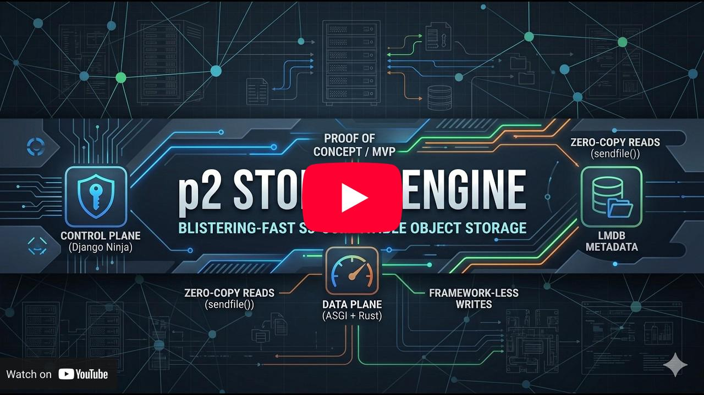

# p2 Storage Engine

[](https://youtu.be/AFO3vRxm_O4)

> **⚠️ Proof of Concept / MVP — work in progress.**
> Not recommended for production use. Expect to fix minor configuration or
> environment issues yourself; feel free to open a discussion instead.

p2 is a fast, S3-compatible object storage server written in Python and
accelerated by native Rust extensions and asynchronous event loops. It is a
fork of the archived [BeryJu/p2](https://github.com/BeryJu/p2).

It is built to handle petabyte-scale metadata via LMDB and high object
throughput by sidestepping traditional framework bottlenecks.

## Features

- **S3 API compatibility** — works with AWS SDKs, MinIO tooling (`warp`),
  Cyberduck, and standard REST tools.
- **Native Rust cryptography** — MD5/SHA256 hashing runs in `p2_s3_crypto`,
  releasing the GIL and streaming payloads concurrently.
- **Proxy-free reads** — Granian streams object bytes directly from the
  append-only volume files; block ranges are resolved from LMDB with no
  reverse proxy and no `sendfile()` handoff.
- **Framework-less write path** — a raw ASGI interceptor takes S3 `PUT` bytes
  off the Granian sockets before Django middleware runs.
- **Append-only volume pool** — fixed-size preallocated volume files, batched
  and fsync-durable writes, with atomic LMDB metadata commits.
- **Control plane & UI** — a modern management interface and typed OpenAPI
  docs via Django Ninja.
- **Access control** — per-bucket ACLs for users and groups, enforced on both
  the control-plane API and the S3 data plane.

## Upcoming Features

- **Webhook Notifications** — push object events (created, deleted, etc.) to
  external HTTP endpoints.
- **Bucket Replication** — replicate buckets to another p2 or S3-compatible
  target.

Want either of these, or something else? Open an issue or a discussion.

## Installation

### Native (recommended)

Runs Granian directly on the host — the lowest-overhead topology and the one p2
is tuned for.

1. Install a Redis- or Dragonfly-compatible server for cache + ARQ (the native
   script does not provision one for you).
2. Copy `.env.example` to `.env` and review secrets, storage paths, and
   hostnames.
3. Launch:

```bash
bash scripts/run_without_docker.sh
```

The server listens on `localhost:8787` and serves the S3 data plane, the Django
control plane, and the SPA directly — no reverse proxy required.

The native Rust extensions are installed from the prebuilt wheels in `wheels/`,
so no Rust toolchain is needed for a normal run. A toolchain is only bootstrapped
if you change `p2/s3/*_ext` (or set `FORCE_REBUILD=1`), in which case the script
rebuilds the wheels from source.

### Docker

For a containerized deployment. On the first boot, use the setup script instead
of calling `docker compose up` directly. It creates/updates `.env`, prepares
storage paths, starts the stack, and recalculates persisted volume stats.

```bash
bash scripts/setup.sh
```

After the first setup, manage the stack with normal Docker commands:

```bash
docker compose up -d
docker compose down
docker compose logs -f web
```

## Limitations

- **Not production-ready.** This is an MVP/work in progress; configuration and
  environment issues are expected.
- **Single-host focus.** Multi-node/clustering is not a supported target yet.
- **Worker load imbalance.** With a small number of keep-alive connections,
  traffic can concentrate on one Granian worker, so throughput varies run to
  run.
- **Throughput can degrade as the dataset grows** and partially recovers on
  restart; not yet diagnosed.
- **Durability defaults favor throughput.** Set `P2_S3__VOLUME__FDATASYNC=true`
  for durable-on-200 semantics; doing so adds PUT latency.
- **PUT-heavy workloads are bound by per-request Python overhead** (auth, ORM,
  Redis) rather than disk.

## License

MIT. See [LICENSE](LICENSE).

p2 is a fork of the archived [BeryJu/p2](https://github.com/BeryJu/p2),
Copyright (c) 2019 BeryJu.org.
